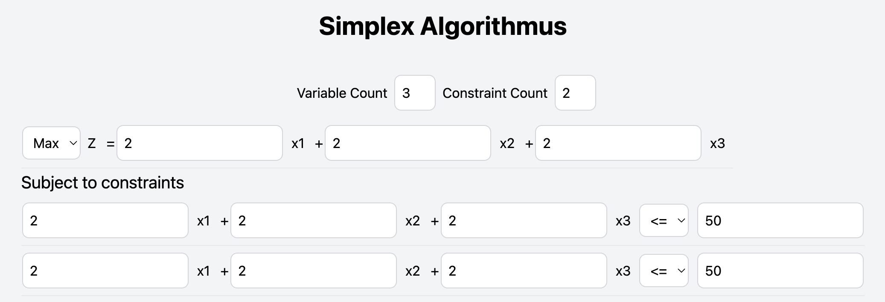

<a name="readme-top"></a>


[![Contributors][contributors-shield]][contributors-url]
[![Forks][forks-shield]][forks-url]
[![Stargazers][stars-shield]][stars-url]
[![Issues][issues-shield]][issues-url]
[![MIT License][license-shield]][license-url]
[![LinkedIn][linkedin-shield]][linkedin-url]


<!-- PROJECT LOGO -->
<br />
<div align="center">
  <a href="https://github.com/johan-stph/algorithm-visualizer">
    
  </a>

<h3 align="center">Algorithm Visualizer</h3>

  <p align="center">
    This project aims to provide a visual representation of various algorithms. And adds the possibility to solve them.
    <br />
    <a href="https://github.com/johan-stph/algorithm-visualizer"><strong>Explore the docs »</strong></a>
    <br />
    <br />
    <a href="https://github.com/johan-stph/algorithm-visualizer">View Demo</a>
    ·
    <a href="https://github.com/johan-stph/algorithm-visualizer/issues">Report Bug</a>
    ·
    <a href="https://github.com/johan-stph/algorithm-visualizer/issues">Request Feature</a>
  </p>
</div>


<!-- TABLE OF CONTENTS -->
<details>
  <summary>Table of Contents</summary>
  <ol>
    <li>
      <a href="#about-the-project">About The Project</a>
      <ul>
        <li><a href="#built-with">Built With</a></li>
      </ul>
    </li>
    <li>
      <a href="#getting-started">Getting Started</a>
      <ul>
        <li><a href="#prerequisites">Prerequisites</a></li>
        <li><a href="#installation">Installation</a></li>
      </ul>
    </li>
    <li><a href="#usage">Usage</a></li>
    <li><a href="#roadmap">Roadmap</a></li>
    <li><a href="#contributing">Contributing</a></li>
    <li><a href="#license">License</a></li>
    <li><a href="#contact">Contact</a></li>
    <li><a href="#acknowledgments">Acknowledgments</a></li>
  </ol>
</details>


<!-- ABOUT THE PROJECT -->
## About The Project
<p align="right">(<a href="#readme-top">back to top</a>)</p>


### Built With

* [![React][React.js]][React-url]]
* [![Redux][Redux]][Redux-url]]
* [![TypeScript][TypeScript]][TypeScript-url]]
* [![Spring][Spring]][Spring-url]]
* [![Tailwind][Tailwind]][Tailwind-url]]

<p align="right">(<a href="#readme-top">back to top</a>)</p>


<!-- GETTING STARTED -->
## Getting Started

Follow this guide to get a local copy up and running.

### Prerequisites

This is an example of how to list things you need to use the software and how to install them.
* npm
  ```sh
  npm install npm@latest -g
  ```
* docker
  ```sh
  https://docs.docker.com/get-docker/
  ```
* Java 17
  ```sh
  https://www.oracle.com/java/technologies/downloads/#java17
  ```

### Installation

1. Clone the repo
   ```sh
   git clone https://github.com/johan-stph/algorithm-visualizer.git
   ```

2. Package the Spring Boot Application
    ```sh
    cd ..
    cd api
    mvn clean package
    ```
3. Build and start the Docker Image
    ```sh
    cd ..
    docker-compose up
    ```
4. Go to Localhost and enjoy the application
    ```sh
    http://localhost:3000/
    ```


<p align="right">(<a href="#readme-top">back to top</a>)</p>


<!-- ROADMAP -->
## Roadmap

- [ ] K-Means Algorithm
- [ ] Simplex Algorithm
- [ ] Dijkstra Algorithm

See the [open issues](https://github.com/johan-stph/algorithm-visualizer/issues) for a full list of proposed features (and known issues).

<p align="right">(<a href="#readme-top">back to top</a>)</p>


<!-- CONTRIBUTING -->
## Contributing

If you have a suggestion that would make this better, please fork the repo and create a pull request. You can also simply open an issue with the tag "enhancement".
Don't forget to give the project a star! Thanks again!

1. Fork the Project
2. Create your Feature Branch (`git checkout -b feature/AmazingFeature`)
3. Commit your Changes (`git commit -m 'Add some AmazingFeature'`)
4. Push to the Branch (`git push origin feature/AmazingFeature`)
5. Open a Pull Request

<p align="right">(<a href="#readme-top">back to top</a>)</p>


<!-- CONTACT -->
## Contact

Johannes Stephan - johannes.uni.kit@gmail.com

Project Link: [https://github.com/johan-stph/algorithm-visualizer](https://github.com/johan-stph/algorithm-visualizer)

<p align="right">(<a href="#readme-top">back to top</a>)</p>


<!-- ACKNOWLEDGMENTS -->
## Acknowledgments

* []()
* []()
* []()

<p align="right">(<a href="#readme-top">back to top</a>)</p>


<!-- MARKDOWN LINKS & IMAGES -->
<!-- https://www.markdownguide.org/basic-syntax/#reference-style-links -->
[contributors-shield]: https://img.shields.io/github/contributors/johan-stph/algorithm-visualizer.svg?style=for-the-badge
[contributors-url]: https://github.com/johan-stph/algorithm-visualizer/graphs/contributors
[forks-shield]: https://img.shields.io/github/forks/johan-stph/algorithm-visualizer.svg?style=for-the-badge
[forks-url]: https://github.com/johan-stph/algorithm-visualizer/network/members
[stars-shield]: https://img.shields.io/github/stars/johan-stph/algorithm-visualizer.svg?style=for-the-badge
[stars-url]: https://github.com/johan-stph/algorithm-visualizer/stargazers
[issues-shield]: https://img.shields.io/github/issues/johan-stph/algorithm-visualizer.svg?style=for-the-badge
[issues-url]: https://github.com/johan-stph/algorithm-visualizer/issues
[license-shield]: https://img.shields.io/github/license/johan-stph/algorithm-visualizer.svg?style=for-the-badge
[license-url]: https://github.com/johan-stph/algorithm-visualizer/blob/master/LICENSE.txt
[linkedin-shield]: https://img.shields.io/badge/-LinkedIn-black.svg?style=for-the-badge&logo=linkedin&colorB=555
[linkedin-url]: https://linkedin.com/in/johannes-stephan-364103204
[product-screenshot]: images/screenshot.png
[React.js]: https://img.shields.io/badge/React-20232A?style=for-the-badge&logo=react&logoColor=61DAFB
[React-url]: https://reactjs.org/
[Spring]: https://img.shields.io/badge/Spring-6DB33F?style=for-the-badge&logo=spring&logoColor=white
[Spring-url]: https://spring.io/
[Tailwind]: https://img.shields.io/badge/Tailwind%20CSS-38B2AC?style=for-the-badge&logo=tailwind-css&logoColor=white
[Tailwind-url]: https://tailwindcss.com/
[TypeScript]: https://img.shields.io/badge/TypeScript-007ACC?style=for-the-badge&logo=typescript&logoColor=white
[TypeScript-url]: https://www.typescriptlang.org/
[Redux]: https://img.shields.io/badge/Redux-593D88?style=for-the-badge&logo=redux&logoColor=white
[Redux-url]: https://redux.js.org/
